```{r setup, include=FALSE}
knitr::opts_chunk$set(echo = FALSE)
```

# 1.0 Critique of Visualization
The original visualization can be seen below.

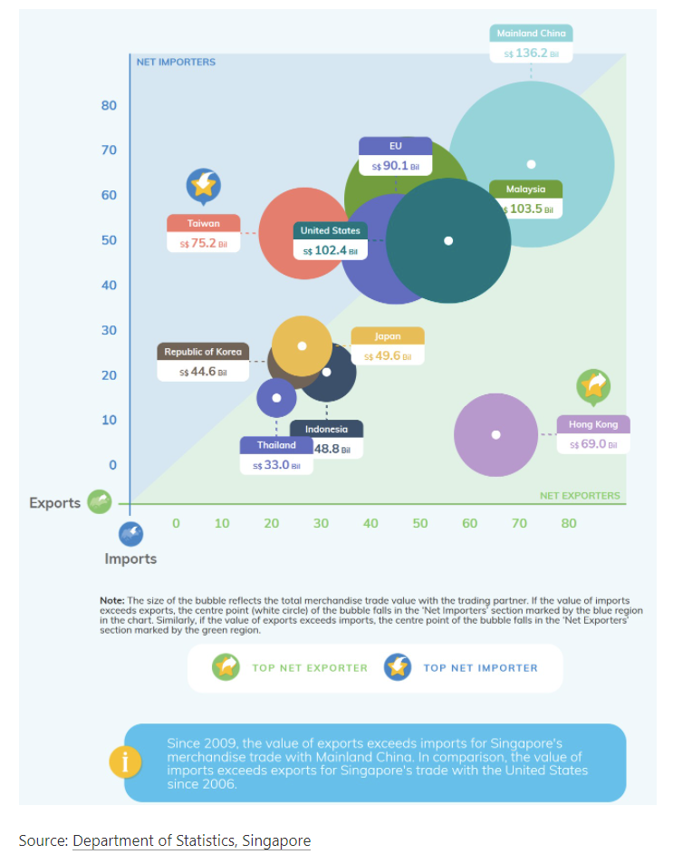

### 1.1 Clarity
1. The title of the graph does not convey the intent of the graph well.

    + The graph does not have title which makes it difficult for readers to understand what the graph is trying to say.The graph is intended to show the comparison of the net exports of the 10 regions and the changes in Singapore's external (10 regions) merchandise trade (exports, imports, net exports) over the last decade.

2. The content of the graph

    + Coordinate axes: On the coordinate axes, there are marked with scale but do not show the unit of the scale.
    + Annotate
        + Notes are too cumbersome.
        + Notes are cluttered at the bottom of the chart.
        + The text size and color of the annotation varies.
        + In the blue background annotate, it gives the explanation of Singapore merchadise trade with the US and China is not shown in the graph.
        + In the graph, add annotate next to the icon for each region that gives a value but does not indicate which index it is.
    + Data
        + The chart does not give the time range of the data used. 
        + Inadequately use of data. Using time series data, but the graph fail to show changes in target variables over time.
        
### 1.2 Aesthetic
1.The color of the circles and notes in the chart are too complex and overlap each other.

2.The explanatory notes below the graph are in different font sizes and colors from each other, and the borders are not aligned.

3. Unnecessary addition of icons in the graph.

# 2.0 Alternative Design
The proposed design is as follows.

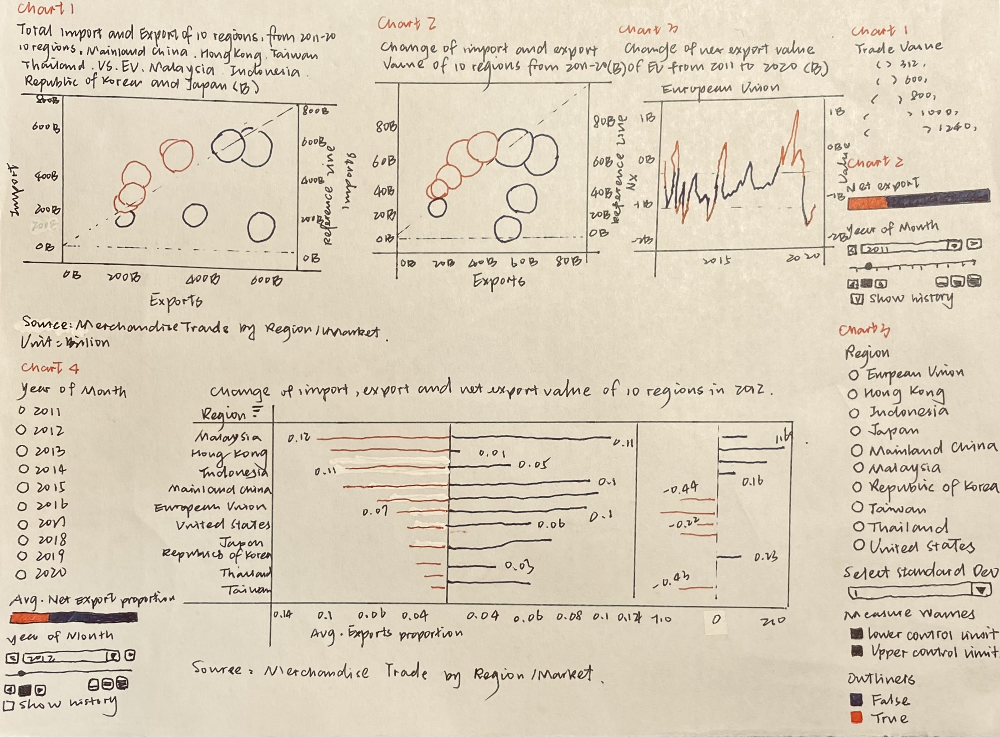

### 2.1 Clarity
1. Use <font color=blue>*'Title'*</font> and <font color=blue>*'Subtitle'*</font> to tell readers the objectives of different graphs in the dashboard.
2. Add note under the graph to indicate the unit of the number.

### 2.2 Aesthetic
1. Use simple color <font color=blue>*'Red'*</font> and <font color=blue>*'Blue'*</font> to indicate the difference of types. It will be easy to read.
2. Remove the unnecessary icons in the graphs.
3. Add useful information in **"Tooltip"**.
4. Show the range of the using data in the graph title.
5. Create a new graph called 'Change of Net export value of <Region> from 2011 to 2020' to show the information in the original blue background annotate.

# 3.0 Proposed Visualization
Please view the interactive visualization on Tableau Public [<font color=grey>*here*.</font>](https://public.tableau.com/app/profile/qian.ziwei/viz/Makeover2_16234698864380/Makeover2)

# 4.0 Step-by-Step Guide
|No|Step| Action |
|--|----|:------:|
1|Unzip the output folder downloaded from the SingStat website. Load the outputFile excel file into Tableau Prep Builder. Drag the <font color=blue>*'T1'*</font> and <font color=blue>*'T2'*</font> worksheet into main pane.| 
2|Use the Data Interpreter. Rename <font color=blue>*'T1'*</font> and <font color=blue>*'T2'*</font> to <font color=blue>*'Import'*</font> and <font color=blue>*'Export'*</font> respectively and initiate the cleaning node from each data node.| 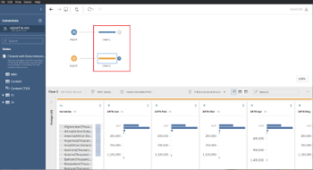
3|Under the <font color=blue>*'Clean 1'*</font> node, clean <font color=blue>*'Variables'*</font> using <font color=blue>*'Split Values'*</font> with <font color=blue>*'('*</font> as the separator. Rename column as <font color=blue>*'Country'*</font>. Repeat for <font color=blue>*'Clean 2'*</font>.|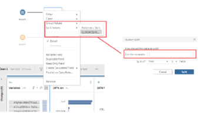
4|Under <font color=blue>*'Clean 1'*</font> node, filter the rows under <font color=blue>*'Country'*</font> to remove non-Country. Repeat for <font color=blue>*'Clean 2'*</font>.| 
5|Under <font color=blue>*'Clean 1'*</font> and <font color=blue>*'Clean 2'*</font>, rename the variable <font color=blue>*'Split-1'*</font> to <font color=blue>*'Region'*</font>.|
6|Add Pivot nodes after <font color=blue>*'Clean 1'*</font> and <font color=blue>*'Clean 2'*</font>. Under <font color=blue>*'Pivot 1'*</font>, select all months under <font color=blue>*'Fields'*</font> to the <font color=blue>*'Pivoted Fields'*</font> panel. Repeat for <font color=blue>*'Pivot 2'*</font>.|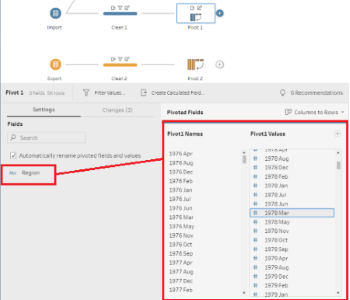
7|Under <font color=blue>*'Pivot 1'*</font>, rename <font color=blue>*'Pivot1 Names'*</font> to <font color=blue>*'Month'*</font> and <font color=blue>*'Pivot1 Values'*</font> to <font color=blue>*'Import (K)'*</font>. Repeat for <font color=blue>*'Pivot 2'*</font> but rename <font color=blue>*'Pivot2 Values'*</font> to <font color=blue>*'Exports(K)'*</font>.|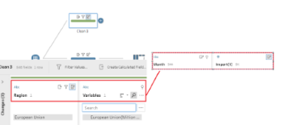
8|Under <font color=blue>*'Pivot 1'*</font> and <font color=blue>*'Pivot 2'*</font>, remove <font color=blue>*'Variables'*</font>.|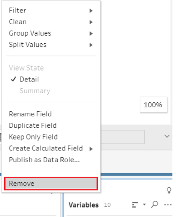
9|Under <font color=blue>*'Pivot 1'*</font> and <font color=blue>*'Pivot 2'*</font>, change <font color=blue>*'Month'*</font> data type to <font color=blue>*'Date'*</font>.|
10|Under <font color=blue>*'Import'*</font> node, add <font color=blue>*'Clean 3'*</font> and choose <font color=blue>*'European Union'*</font> only. Under <font color=blue>*'Export'*</font> node, add <font color=blue>*'Clean 4'*</font> and choose <font color=blue>*'European Union'*</font> only.|
11|Under <font color=blue>*'Clean 3'*</font> and <font color=blue>*'Clean 4'*</font> nodes, repeat for <font color=blue>*'Clean 1'*</font> and <font color=blue>*'Clean 2'*</font>. But not change the <font color=blue>*'Pivot values'*</font>.|
12|Under <font color=blue>*'Pivot 3'*</font> and <font color=blue>*'Pivot 4'*</font> nodes, create a new calculated field to unify the unit of <font color=blue>*'European Union'*</font> and remove <font color=blue>*'Pivot values'*</font>.|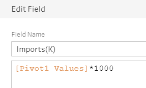
13|Do a union between <font color=blue>*'Pivot 1'*</font> and <font color=blue>*'Pivot 3'*</font>, another between <font color=blue>*'Pivot 2'*</font> and <font color=blue>*'Pivot 4'*</font> and remove <font color=blue>*'Table names'*</font> column.|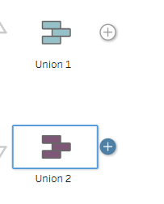
14|Under <font color=blue>*'Import'*</font> node, add <font color=blue>*'Clean 5'*</font> and choose <font color=blue>*'Total Merchandise Imports'*</font> only. Under <font color=blue>*'Export'*</font> node, add <font color=blue>*'Clean 6'*</font> and choose <font color=blue>*'Total Merchandise Imports'*</font> only.|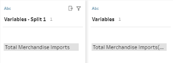
15|Under <font color=blue>*'Clean 5'*</font> and <font color=blue>*'Clean 6'*</font> nodes, add <font color=blue>*'Pivot 5'*</font> and <font color=blue>*'Pivot 6'*</font>. Delete unnecessary fields, rename variables and change variable type.|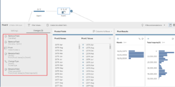
16|Do a full join between <font color=blue>*'Union 1'*</font> and <font color=blue>*'Pivot 5'*</font>, <font color=blue>*'Union 2'*</font> and <font color=blue>*'Pivot 6'*</font>. With <font color=blue>*'Month'*</font> as the join clauses. Remove unnecessary fields <font color=blue>*'Month-1'*</font>.|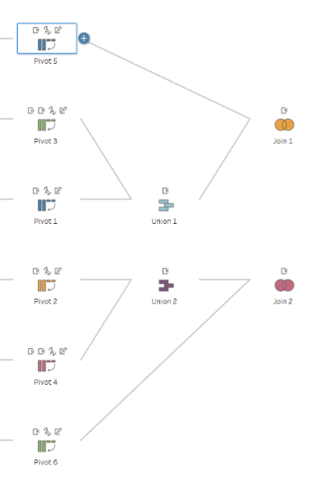
17|Do a full join between <font color=blue>*'Join 1'*</font> and <font color=blue>*'Join 2'*</font> with <font color=blue>*'Region'*</font> and <font color=blue>*'Month'*</font> as the join clauses. Remove unnecessary fields 'Month-1' and 'Region-1'. Create a 'Clean' node after <font color=blue>*'Join 3'*</font> to merge duplicated country and month variables.|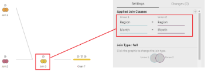
18|Add new calculation fields using <font color=blue>*'Imports(K)'*</font> and <font color=blue>*'Exports(K)'*</font> by 1000 and name <font color=blue>*'Imports'*</font> and <font color=blue>*'Exports'*</font>. Use <font color=blue>*'Filter'*</font> under <font color=blue>*'Month'*</font> column and choose the time from January 2011 to December 2020.Remove the unnecessary fields.|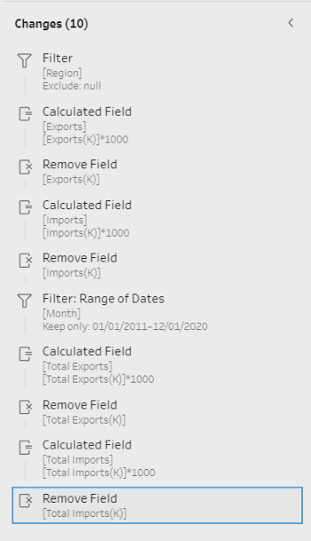
19|Create a <font color=blue>*'Output'*</font> node after <font color=blue>*'Clean 7'*</font> node and save output as <font color=blue>*'Singapore Merchandise Trade by Region_New’*</font>.|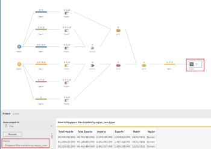
20|Import the data into Tableau.|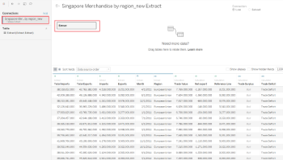
21|For chart 1, create a new worksheet called <font color=blue>*'M&X'*</font>. Drag <font color=blue>*'Exports'*</font> to **"Columns"** and <font color=blue>*'Imports'*</font> to **"Rows"**.|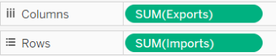
22|Create a new calculation field called <font color=blue>*'Trade Value'*</font>.|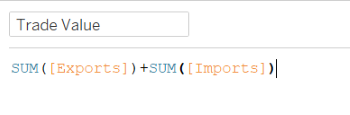
23|Create a new calculation field called <font color=blue>*'Net export'*</font>.|
24|Under **"Marks"** panel, use <font color=blue>*'Net export'*</font> as **"Color"**; <font color=blue>*'Trade Value'*</font> as **"Size"** and <font color=blue>*'Region'*</font> as **"Detail"**; <font color=blue>*'Region'*</font> as **"Label"**. Choose the **"Circle"** as shape.|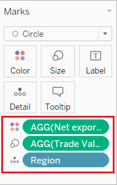
25|Edit the color of <font color=blue>*'Net export'*</font>, choose **"Red-Blue Diverging"**, **"Use Full Color Range"** and **"Center"** from **"0"**. Under **"Marks"** panel, change **"Opacity"** to 80% and **"Border"** to white.|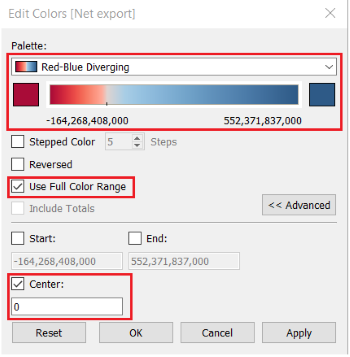 
26|Create a new calculation field called <font color=blue>*'Reference Line'*</font>.|
27|Drag <font color=blue>*'Reference Line'*</font> to **"Rows"**. Under <font color=blue>*'SUM(Reference Line)'*</font> choose **"Dual Axis"** and right click on y-axis choose **"Synchronize Axis"**.|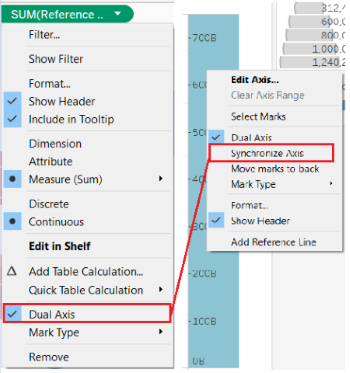
28|Right click on the shape of <font color=blue>*'Reference Line'*</font> and choose **"Show Trend Lines"**. Under **"Marks"** of <font color=blue>*'SUM(Reference Line)'*</font>, make the color of <font color=blue>*'SUM(Reference Line)'*</font> is transparent.|
29|Create a new calculation field called <font color=blue>*'Trade Deficit'*</font>.|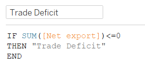
30|Create a new calculation field called <font color=blue>*'Trade Surplus'*</font>.|
31|Create a new calculation field called <font color=blue>*'Ranking by Net Export'*</font>.|
32|Under **"SUM(Imports) Marks"**, drag <font color=blue>*'Imports'*</font>, <font color=blue>*'Exports'*</font>, <font color=blue>*'Net Exports'*</font>, <font color=blue>*'Ranking by Net Export'*</font>, <font color=blue>*'Trade Deficit'*</font> and <font color=blue>*'Trade Surplus'*</font> into **"Tooltip"**. Edit the content of the **"Tooltip"** and change the units of <font color=blue>*'SUM'*</font> variables.|
33|Click on the small triangle of the  <font color=blue>*'Ranking by Net Export'*</font> and choose **"Computing by region"**. The **"Tooltip"** looks like the picture.|
34|Create a new worksheet called <font color=blue>*'Time Series'*</font>. Drag <font color=blue>*'Month'*</font> to **"Columns"**, <font color=blue>*'Net Export'*</font> to **"Rows"** and **"Color"**.  **"Color"** is the same in **"M&X"**.|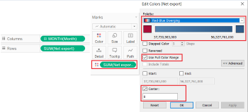
35|Drag <font color=blue>*'Region'*</font> to **"Filters"** panel. Right click on <font color=blue>*'Region'*</font> and choose **"Show Filter"**. Under **"Region"** panel, right click on small triangle. Choose the **"Single Value"** and cancel **"Show All Value"**. Add an reference line of average.|
36|Insert <font color=blue>*'Region'*</font> into the graph title and back to **"M&X"**. Insert the new graph to **"Tooltip"**.|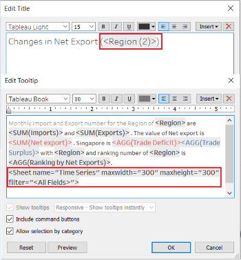
37|The final graph looks like the picture and the title of the graph is <font color=blue>*'Total merchandise import and export of 10 regions, from 2011-2020'*</font>, subtitle is <font color=blue>*'10 regions: Mainland China, Hong Kong, Taiwan, Thailand, United States, European Union, Malaysia, Indonesia, Republic of Korea and Japan.'*</font>|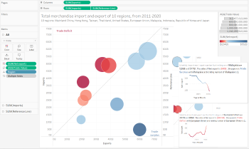
38|Duplicate **"M&X"** and rename **"Interactive M&X"**. Remove the content of **"Tooltip"** and edit new content.|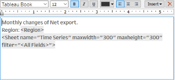
39|Drag <font color=blue>*'Month'*</font> into pages. From **"Year"** panel, click on **"Show history"** and **"Show Trails"**.|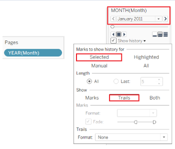
40|Click on **"Format"** and **"Animations"**. Under **"Animations"** panel, click on **"On"** of **"Workbook Default"** and change **"Duration"** to **"1.00 seconds(Slow)".**|
41|The final graph looks like the picture and the title of the graph is <font color=blue>*'Change of  merchandise import and export value of 10 regions from 2011 to 2020.'*</font>|
42|Create a new **"Worksheet"** called **"Changes in Regions"**. Create a new parameter called **"Select Standard Deviation"**.|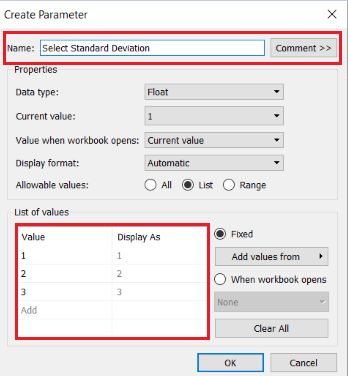
43|Create new calculations called <font color=blue>*'Lower control limit'*</font> and <font color=blue>*'Upper control limit'*</font> separately.|
44|Drag <font color=blue>*'Region'*</font>, <font color=blue>*'Month'*</font> to **"Columns"**; <font color=blue>*'Net export'*</font>, <font color=blue>*'Lower control limit'*</font>, <font color=blue>*'Upper control limit'*</font> to **"Rows"**; <font color=blue>*'Region'*</font> to **"Filters"** and choose the **"Show Filters"**. Right click on <font color=blue>*'Select Standard Deviation'*</font> and choose **"Show Parameter"**.|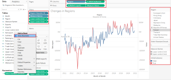
45|Create a new calculation called <font color=blue>*'Outliers'*</font> and drag to **"Color"** under **"SUM(Net export) Marks"**.|
46|The final graph looks like the picture and the title of the graph is <font color=blue>*'Change of net export value of  <Region> from 2011 to 2020'*</font>.|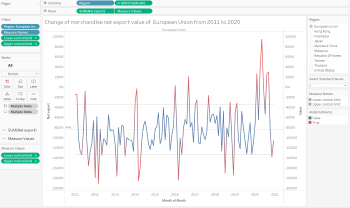
47|Create a new worksheet called **"Changes in Proportions"**. Create new calculations <font color=blue>*'Exports proportion'*</font>, <font color=blue>*'Import proportion'*</font> and <font color=blue>*'Net Export proportion'*</font>.|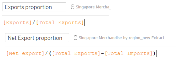
48|Drag <font color=blue>*'Exports proportion'*</font>, <font color=blue>*'Import proportion'*</font> and <font color=blue>*'Net Export proportion'*</font> to **"Columns"**, <font color=blue>*'Region'*</font> to **"Rows"**. Right click on y-axis of <font color=blue>*'Exports proportion'*</font> and choose **"Reversed"**.|
49|Drag <font color=blue>*'Month'*</font> to **"Pages"** and **"Filters"**. Drag <font color=blue>*'Exports proportion'*</font>, <font color=blue>*'Import proportion'*</font> and <font color=blue>*'Net Export proportion'*</font> to **"Label"**.|
50|The final graph looks like the picture and the title of the graph is <font color=blue>*'Change of import, export and net export value of  10  regions in <YEAR(Month)>'*</font>.|
51|Create a dashboard called <font color=blue>*'Makeover'*</font> and put all graphs in. Add the data source address and calculation unit.|

# 5.0 Derived Insights
1. Chart 1: From total merchandise import and export number perspective

    + Singapore's merchandise trade with the three regions(Thailand, Malaysia and Mainland CHina) is more balanced and slightly advantageous from 2011 to 2020. 
    + Singapore is very dominant in its foreign merchandise trade with Hong Kong, with a total net export value of 552 Billion over the decade. 
    + But for Taiwan is dominant the merchandise trade with Singapore,  with a total net export value of -164 Billion over the decade.


2. Chart 2: From the changes of total merchandise import and export number from 2011 to 2020 perspective

      + For trade deficit perspective, the Taiwan is still dominant the merchandise trade with Singapore. But the United States loss the dominant position in 2020.
          + For Taiwan, Singapore trade disadvantage gradually strengthened from 2011 to 2020.
      
          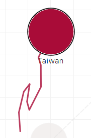
      
          + For United States, Singapore trade disadvantage gradually strengthened from 2011 to 2019. But in 2020, Singapore win the dominant position.
      
          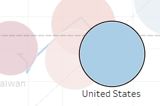
          
      + For trade surplus perspective, the Hong kong is an very important trade partner. From 2011 to 2020, the net export value of Hong Kong exceed other regions a lot.
      
3. Chart 4: We can found that the import and export value of Mainland China, Malaysia is 10% of the total merchandise trade number of Singapore respectively from 2011-2020. So these three regions are important trade partners for Singapore.
      
      
      

